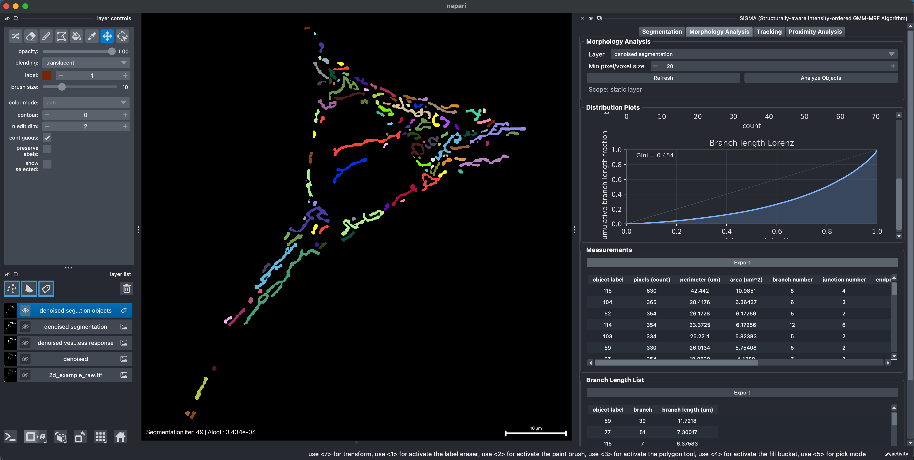
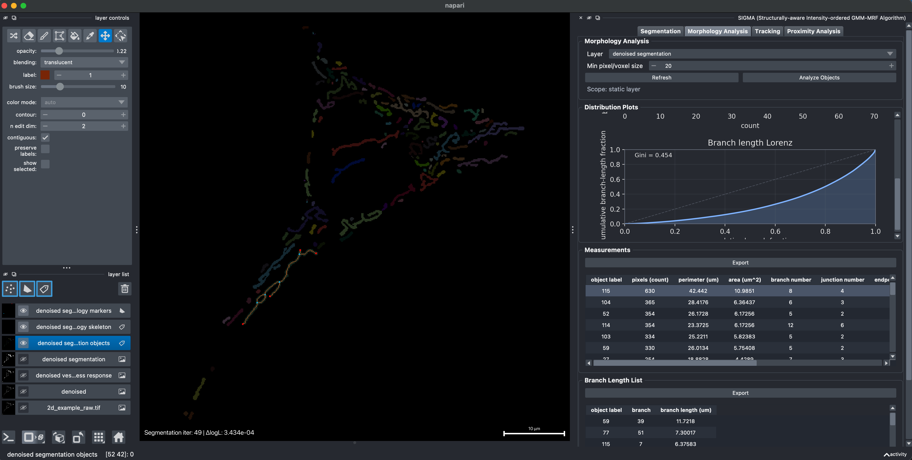
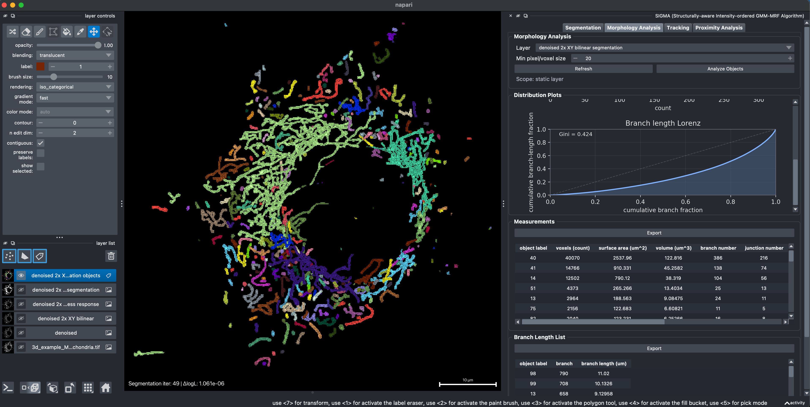
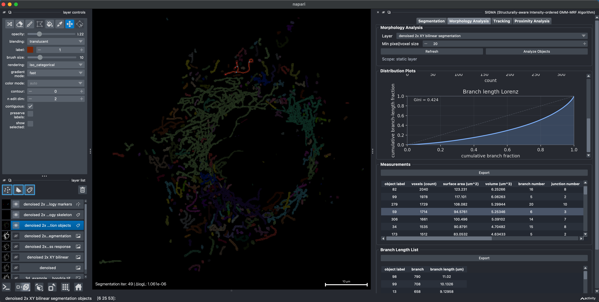
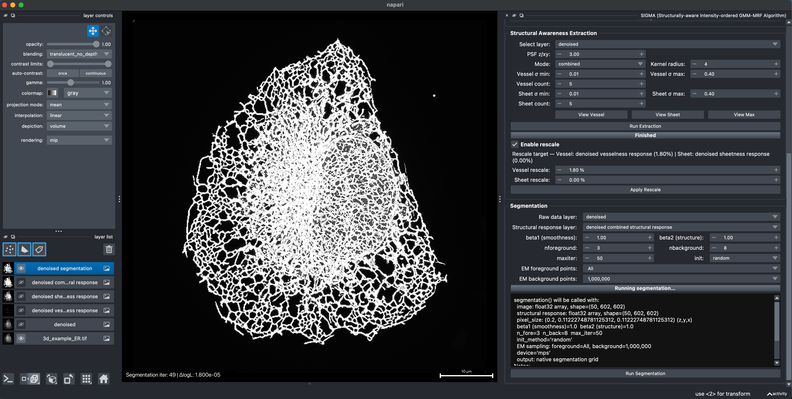
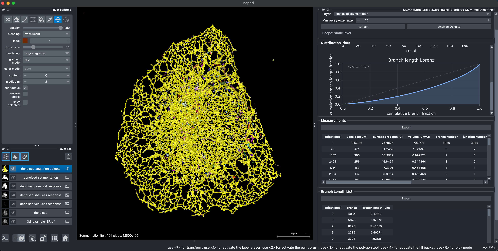
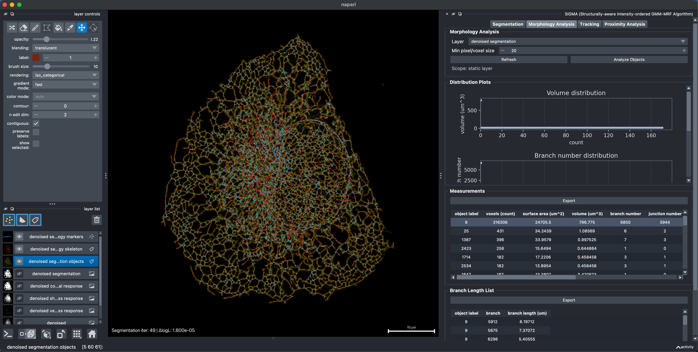

# Morphology Analysis

Morphology Analysis converts a SIGMA foreground mask into connected objects and measures their geometry and skeleton topology in 2D or 3D. Calibrated pixel or voxel spacing is used for physical area, surface area, volume, and branch-length measurements.

## 2D morphology example

**Example data:** [`2d_example_raw.tif`](../example/2d/2d_example_raw.tif). First generate its mask by following the [2D segmentation example](./segmentation.md#2d-segmentation-example), then select that segmentation layer for morphology analysis.

### 1. Analyze objects and review measurements

After obtaining the 2D segmentation, open **Morphology Analysis**, select the segmentation layer, set the minimum object size, and click **Analyze Objects**. SIGMA labels the connected foreground objects and reports their morphology statistics in the right panel.

The plots summarize object and branch distributions, including the branch-length Lorenz profile and its Gini coefficient. **Measurements** reports values such as pixel count, perimeter, area, branch number, junction number, and endpoint number, while **Branch Length List** reports the individual skeleton branches.

### 2. Inspect an object interactively

Double-click an object in the viewer or click its row in **Measurements** to inspect it. SIGMA displays the selected object's skeleton, junction points, and endpoints. A branch selected from **Branch Length List** is highlighted together with its topology markers.

## 3D mitochondrial morphology example

**Example data:** [`3d_example_Mitochondria.tif`](../example/3d/3d_example_Mitochondria.tif). First generate its mask by following the [3D mitochondrial segmentation example](./segmentation.md#3d-mitochondrial-segmentation-example), including the 2x XY upsampling step used to reduce bridging between closely apposed objects.

### 1. Analyze objects and review measurements

After obtaining the 3D mitochondrial segmentation, open **Morphology Analysis**, select the segmentation layer, set the minimum object size, and click **Analyze Objects**. SIGMA identifies the connected mitochondrial foreground objects and displays them as an object-label layer.

The right panel reports the morphology statistics. **Distribution Plots** summarize object size and branch properties, **Measurements** lists object-level values such as voxel count, surface area, volume, branch number, junction number, and endpoint number, and **Branch Length List** reports the individual skeleton branches.

### 2. Inspect an object interactively

Double-click a mitochondrion in the viewer or click its object row in **Measurements**. SIGMA links the image and table selection, then displays the selected object's skeleton, junction points, and endpoints. Selecting a row in **Branch Length List** additionally highlights that individual branch.

## 3D ER morphology example

**Example data:** [`3d_example_ER.tif`](../example/3d/3d_example_ER.tif). Generate a vesselness-guided segmentation from this volume before running morphology analysis, as described below.

### 1. Prepare a vesselness-aware segmentation

For ER morphology analysis, first create a segmentation guided by the tubular vesselness response from **Structural Awareness Extraction**. The important point is that vesselness contributes the local structural evidence used for segmentation; the extraction mode itself can be chosen to suit the data. If needed, strengthen the vesselness contribution with **Vessel rescale**, then run SIGMA to obtain a mask suited to skeleton and branch analysis.

### 2. Analyze objects and review measurements

Select the resulting ER segmentation in **Morphology Analysis** and click **Analyze Objects**. SIGMA separates the connected ER structures and reports their object measurements, distribution plots, and individual branch lengths in the right panel.

### 3. Inspect ER topology interactively

As in the preceding examples, double-click an ER object in the viewer or click its row in **Measurements** to display its skeleton, junction points, and endpoints. Selecting a branch row highlights the corresponding branch and topology markers.

## Run an analysis

1. Select a binary or labels layer under **Layer**.
2. Set **Min pixel/voxel size**.
3. Press **Analyze Objects**.

For a time series, the analysis follows the frame currently shown in napari. The scope label reports the active frame. **Refresh** rebuilds the layer list after layers are added or removed.

The minimum-size setting filters reported objects, tables, and plots. It does not modify the source segmentation layer.

## Measurements

Measurements include object size, calibrated area or volume, perimeter or surface area, skeleton length, branch statistics, endpoints, junctions, and topology summaries. Values are reported in pixels or voxels when physical calibration is unavailable.

In the skeleton graph, endpoints have one neighbor and junctions have three or more neighbors. Branches are paths between endpoints and junctions, measured using the physical pixel or voxel spacing. Selecting an object row displays the corresponding skeleton, junction points, and endpoints in the image. Selecting a branch row highlights that branch together with its topology markers.

## Distribution plots

The distribution area summarizes object and branch measurements for the current analysis. The branch-length Lorenz curve and Gini coefficient describe how branch length is distributed across the analyzed network. Plots update when the minimum-size filter or active frame changes.

## Branch Length List

The branch table contains individual skeleton branches and their lengths. Endpoint and junction markers are displayed at a compact size so they do not obscure the segmented structure.

## Export

- **Export** writes the complete time series for a temporal segmentation, or the current result for a static segmentation.
- Supported table formats are CSV, tab-delimited TXT, and XLSX.

Exported values retain frame identifiers and physical units when those values are available from the selected layer.
