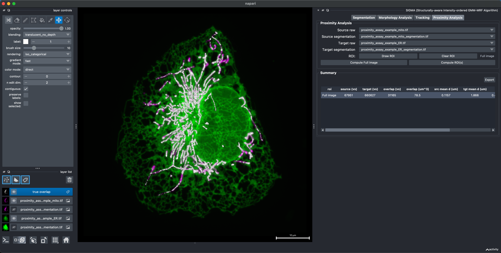
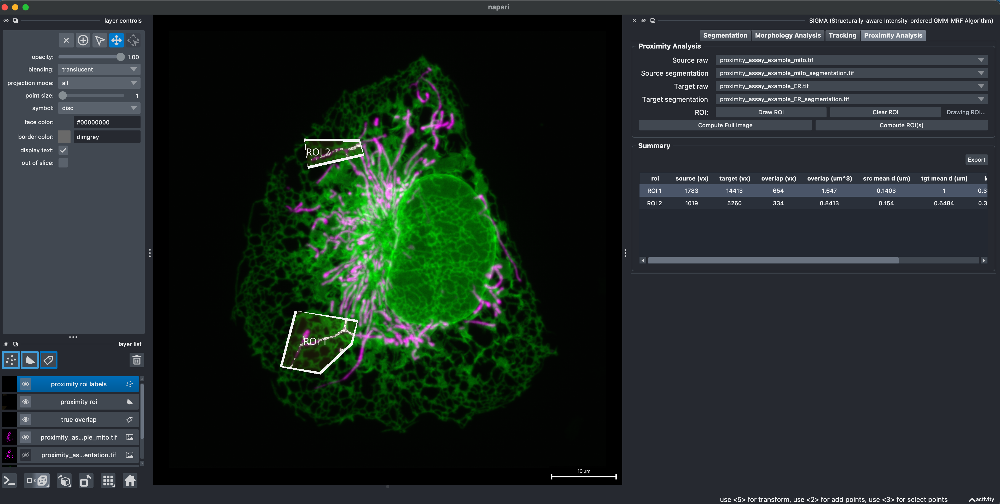

# Proximity Analysis

Proximity Analysis quantifies spatial association between structures segmented independently in two aligned fluorescence channels. It combines mask overlap, directional intensity fractions, and nearest-target distances over the full image or within polygon regions of interest.

These measurements are defined at the image resolution. They do not estimate physical membrane separation and should not, by themselves, be interpreted as evidence of molecular contact.

## Select layers

Choose four aligned layers:

- **Source raw**
- **Source segmentation**
- **Target raw**
- **Target segmentation**

The source and target pairs must describe the same field of view, dimensionality, and time points. Correct physical scale metadata before computing distance or physical-size measurements.

## 3D mitochondria-ER proximity assay example

This example measures the image-resolved spatial relationship between segmented mitochondria and ER in the same calibrated 3D field of view. Mitochondria are treated as the source and ER as the target.

### 1. Load the aligned image and segmentation layers

Open the four aligned example TIFF files:

- [`proximity_assay_example_mito.tif`](../example/Proximity_analysis/proximity_assay_example_mito.tif) as **Source raw**
- [`proximity_assay_example_mito_segmentation.tif`](../example/Proximity_analysis/proximity_assay_example_mito_segmentation.tif) as **Source segmentation**
- [`proximity_assay_example_ER.tif`](../example/Proximity_analysis/proximity_assay_example_ER.tif) as **Target raw**
- [`proximity_assay_example_ER_segmentation.tif`](../example/Proximity_analysis/proximity_assay_example_ER_segmentation.tif) as **Target segmentation**

Confirm that all four layers use the same shape, voxel size, and spatial alignment before computing the assay.

### 2. Compute the full-image assay

Click **Compute Full Image** to analyze the complete volume. In the visualization, mitochondria are shown in magenta, ER in green, and voxels shared by both segmentation masks appear in the white **true overlap** layer.

The **Summary** row reports source and target volume, true overlap in voxels and physical units, directional mean distances, Manders coefficients, Dice, and Jaccard values for the complete image. White overlap indicates voxels assigned to both masks; it is not a direct measurement of the distance between the mitochondrial and ER membranes.

### 3. Compare selected ROIs

Click **Draw ROI** and draw one or more polygons around regions to compare. For this 3D dataset, each polygon is drawn in XY and applied through the full Z volume. Click **Compute ROI(s)** when the polygons are complete; SIGMA then returns to the previous 3D camera view.

Each polygon receives its own ROI label and an independent row in **Summary**. This makes it possible to compare local mitochondrial and ER abundance, overlap, and image-resolved distance without changing the original segmentations.

## Full-image analysis

Press **Compute Full Image** to analyze every available frame and spatial location. SIGMA creates visualization layers for overlap and proximity assignments and fills the Summary table.

## ROI analysis

1. Press **Draw ROI**.
2. Draw one or more polygons in the napari 2D view.
3. Press **Compute ROI(s)**.

For a time series, an ROI belongs to the frame in which it was drawn. For a 3D volume, ROI polygons are drawn in the 2D XY view and applied through the full Z volume. After **Compute ROI(s)** finishes, SIGMA returns to the previous 3D camera view. napari does not support drawing or editing Shapes polygons directly in the 3D view. **Clear ROI** removes the current ROI definitions.

## Reported measurements

The Summary table includes available values such as:

- source, target, overlap, and union size
- physical size when calibrated metadata is available
- Dice and Jaccard coefficients
- Manders M1 and M2 intensity coefficients
- proximity-restricted Manders coefficients
- nearest-object and surface-proximity measurements

**Manders M1** is the fraction of source-channel intensity inside the target mask. **Manders M2** is the reciprocal fraction of target-channel intensity inside the source mask. Geometric overlap is the fraction of the source mask intersecting the target mask. Directional mean and median distances are calculated from each source-mask or target-mask pixel/voxel to the nearest location in the other mask using calibrated spatial spacing when available.

Selecting a Summary row filters the detailed proximity measurements to the corresponding ROI.

## Export

Press **Export** to save the Summary table as CSV, tab-delimited TXT, or XLSX. The export includes ROI and frame identifiers so full-image and ROI analyses can be combined downstream.
