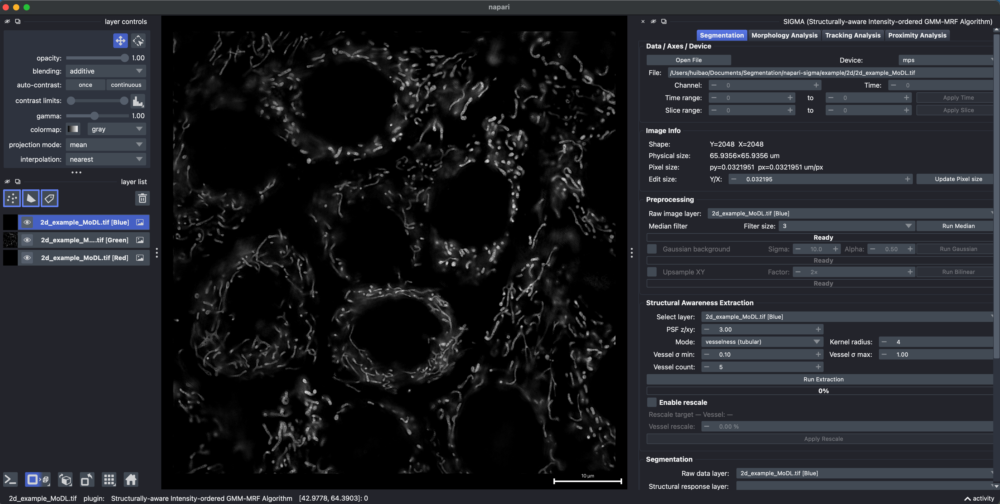
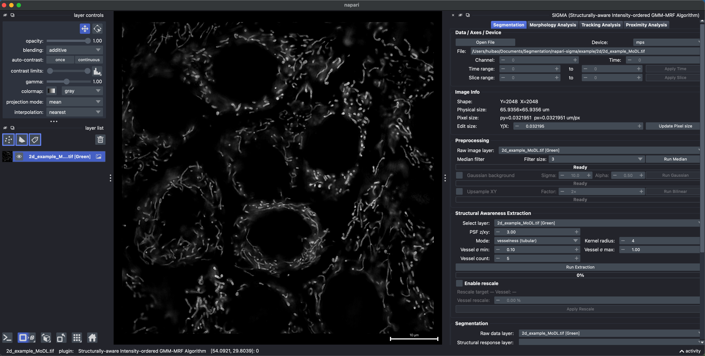
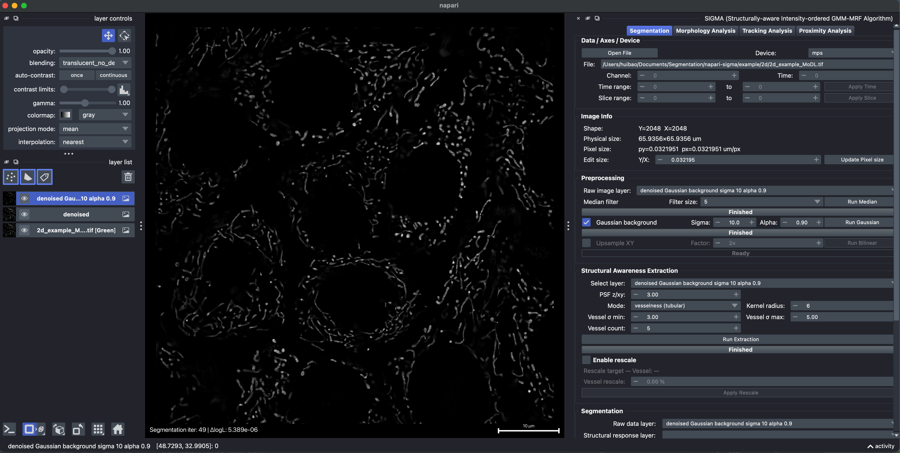
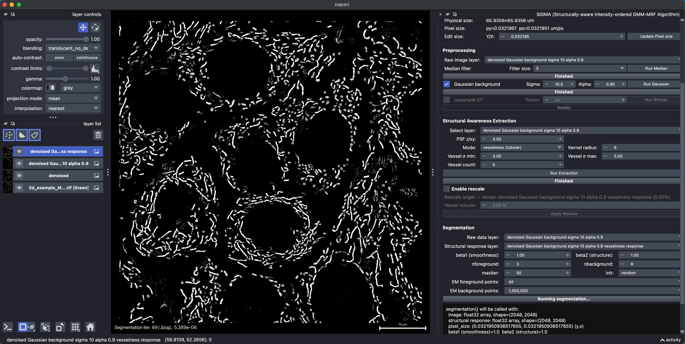
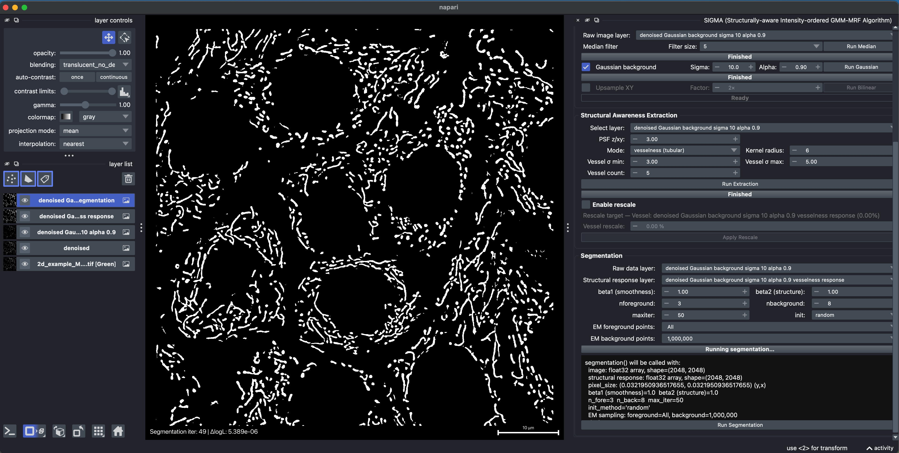
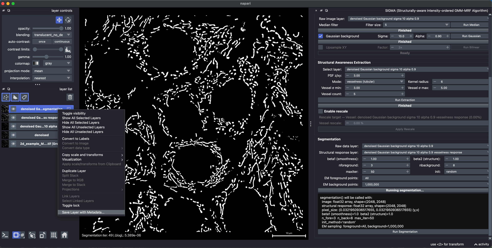

# Segmentation: 2D mitochondria (data from MoDL)

[All examples](../README.md#examples) · [Segmentation reference](./segmentation.md)

This example uses `4.tif` from the [MoDL Zenodo release](https://zenodo.org/records/10889134), provided here as [`2d_example_MoDL.tif`](../example/2d/2d_example_MoDL.tif). The source study is [Ding et al. (2025)](https://doi.org/10.1038/s41467-025-55825-x). The workflow below applies SIGMA to this image.

Compared with the [basic 2D example](./segmentation-2d.md), this image has pronounced diffuse background and heterogeneous fluorescence within individual mitochondria. The workflow therefore includes Gaussian background subtraction and coarser-scale vesselness extraction.

## 1. Load the raw image

Drag the TIFF into napari or load it with **Open File**. In this example, the RGB image opens as three layers labeled **Red**, **Green**, and **Blue**.

Review **Image Info**. The image is 2048 x 2048 pixels; the calibration shown in this example is approximately 0.0321951 x 0.0321951 um (Y, X).

## 2. Keep the mitochondrial signal channel

Inspect the channels individually. For this image, the mitochondrial signal is in **Green**; the **Red** and **Blue** layers contain no signal. Select the two empty layers in the **layer list** and remove them with the trash button, leaving only **Green**. This removes layers from the viewer without modifying the source TIFF.

Select the retained Green layer under **Raw image layer** in **Preprocessing**.

## 3. Suppress diffuse out-of-focus background

The image shows prominent diffuse fluorescence consistent with an out-of-focus background contribution. This produces a spatially slowly varying haze around the sharper mitochondrial structures. Gaussian background subtraction reduces this low-spatial-frequency component, complementing the removal of isolated noise by median filtering.

1. Select the Green layer, set the median **Filter size** to **5**, and click **Run Median**.
2. Enable **Gaussian background**, set **Sigma** to **10.0** and **Alpha** to **0.90**, then click **Run Gaussian**. This step operates on the median-filtered image.
3. Leave **Upsample XY** unchecked. Use the Gaussian-background-corrected layer for subsequent extraction and segmentation.

The Gaussian background sigma is measured in XY pixels and controls the scale of the smooth background estimate; alpha controls how much of that estimate is subtracted. This is background correction, not deconvolution or optical sectioning.

## 4. Extract tubular structure at coarser spatial scales

The MitoTracker-labeled mitochondria in this example exhibit heterogeneous intramitochondrial fluorescence texture rather than uniformly filled tubular profiles. At very small scales, these internal intensity variations can dominate the structural response. Here, larger Gaussian scales are chosen so that the Hessian-based vesselness response integrates information over a wider local neighborhood, emphasizing the overall tubular organization over fine internal texture.

Under **Structural Awareness Extraction**, select the Gaussian-background-corrected layer and set:

- **Mode:** `vesselness (tubular)`
- **Kernel radius:** `6`
- **Vessel sigma min/max:** `3.00` to `5.00` (XY pixels)
- **Vessel count:** `5`
- **Enable rescale:** unchecked

Click **Run Extraction** and inspect the response. These vesselness scales serve a different purpose from the background sigma of 10.0: they select the local structural scales to emphasize, rather than estimating diffuse background. Larger scales can also blur distinctions between nearby structures, so check that neighboring mitochondria remain distinguishable.

## 5. Run SIGMA

Choose the Gaussian-background-corrected intensity image as **Raw data layer** and its vesselness result as **Structural response layer**. Use:

- `beta1 = 1.00` and `beta2 = 1.00`
- `nforeground = 3` and `nbackground = 8`
- `maxiter = 50` and `init = random`
- **EM foreground points:** `All`; **EM background points:** `1,000,000`

Click **Run Segmentation**. SIGMA combines intensity evidence, neighborhood coherence, and the coarser-scale structural response to generate a foreground mask on the original 2048 x 2048 grid. The mask shown here is a SIGMA result, not a MoDL prediction or ground-truth annotation.

## 6. Save the result with metadata

After segmentation finishes, select the result in napari's **layer list**, right-click it, and choose **Save Layer with Metadata...**. Save as **TIFF (`.tif` or `.tiff`)** to retain source-derived metadata, including axes, physical pixel sizes, and units, together with the result.

The saved calibration follows the selected layer. This workflow does not upsample the image, so its XY sampling and pixel size remain unchanged. Use TIFF rather than PNG or JPEG when physical-size metadata must be preserved.

## Data source and citation

Please credit the original MoDL study and Zenodo release when using this example data:

- Ding et al. (2025). [Mitochondrial segmentation and function prediction in live-cell images with deep learning](https://doi.org/10.1038/s41467-025-55825-x). *Nature Communications* **16**, 743.
- Northwestern Polytechnical University (2024). [MoDL release, version v1](https://doi.org/10.5281/zenodo.10889134). Zenodo. Source image: `4.tif` from `MoDL_OBP.zip`, named `2d_example_MoDL.tif` in this repository.
