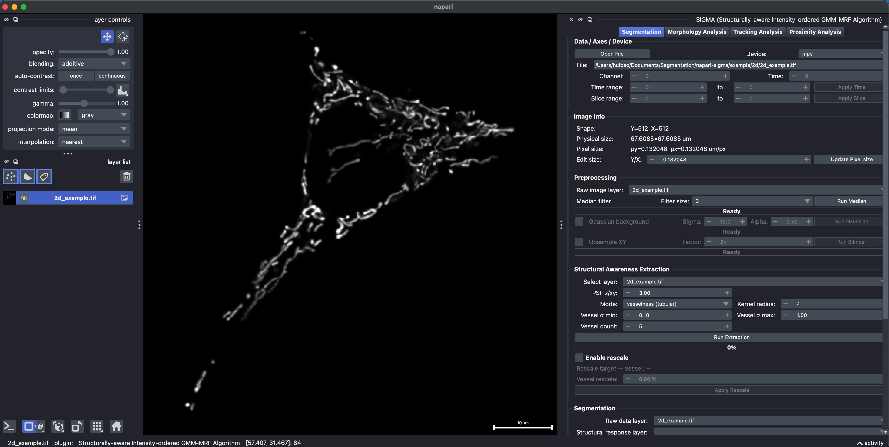
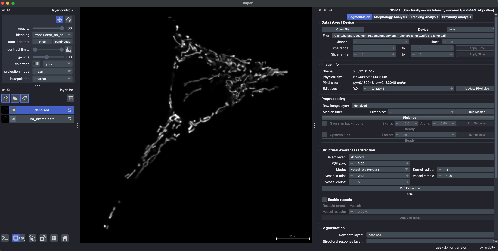
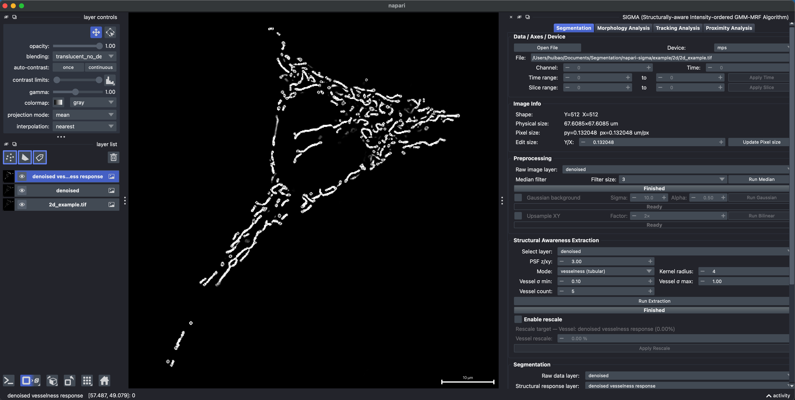
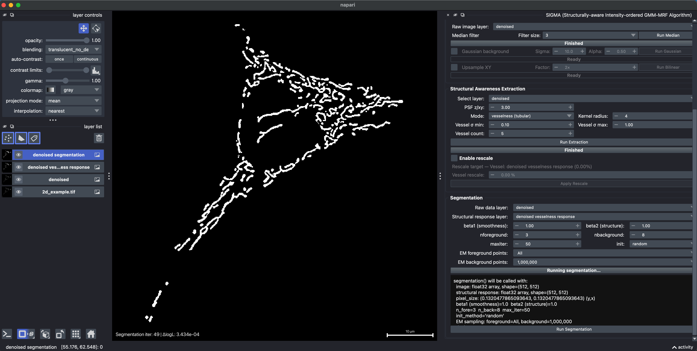
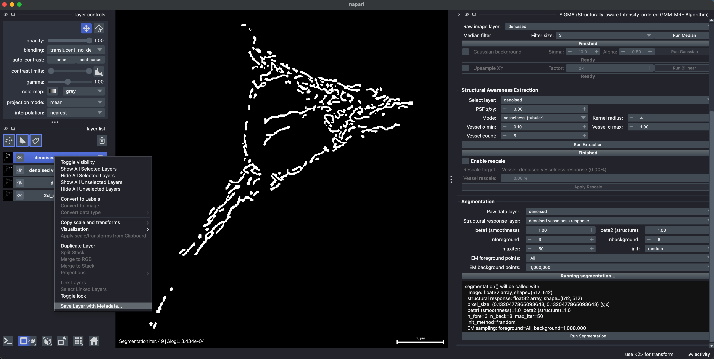

# Segmentation: 2D mitochondria

[All examples](../README.md#examples) · [Segmentation reference](./segmentation.md)

This example segments a 2D mitochondrial image on a 512 x 512 grid, with a pixel size of approximately 0.132048 x 0.132048 um (Y, X).

**Example data:** [`2d_example.tif`](../example/2d/2d_example.tif)

## 1. Load the raw image

Drag the 2D image directly into napari, or click **Open File** and choose its file path. Confirm the pixel size, then select the raw layer as the input for preprocessing and structural awareness extraction.

## 2. Remove salt-and-pepper noise

Under **Preprocessing**, select the raw image, set the median filter size to 3, and click **Run Median** to suppress isolated noise while retaining the narrow mitochondrial signal. Leave **Gaussian background** and **Upsample XY** unchecked for this example; processing stays on the original 512 x 512 grid.

## 3. Enhance mitochondrial structures with vesselness

Under **Structural Awareness Extraction**, select the median-filtered layer and choose **vesselness** mode. Set a kernel radius of 4, a vessel sigma range of 0.10 to 1.00, and five scales, then click **Run Extraction**. Leave **Enable rescale** unchecked. The multiscale Hessian-derived vesselness response provides local evidence for tubular mitochondrial structures during segmentation.

## 4. Run SIGMA

Use the median-filtered intensity image as **Raw data layer** and the vesselness result as **Structural response layer**. This example uses:

- `beta1 = 1.00` and `beta2 = 1.00`
- `nforeground = 3` and `nbackground = 8`
- `maxiter = 50` and `init = random`
- **EM foreground points:** `All`; **EM background points:** `1,000,000`

Click **Run Segmentation**. The intensity-ordered GMM estimates foreground and background intensity states from this image, while the MRF combines neighborhood coherence with the vesselness evidence. The binary foreground mask appears as a new napari layer.

## 5. Save the result with metadata

After segmentation finishes, select the result in napari's **layer list**, right-click that layer, and choose **Save Layer with Metadata...**. Save as **TIFF (`.tif` or `.tiff`)** to retain source-derived metadata, including axes, physical pixel sizes, and units, together with the result.

The saved calibration follows the selected layer. This example retains the original XY sampling and pixel size. Use TIFF rather than PNG or JPEG when physical-size metadata must be preserved.

