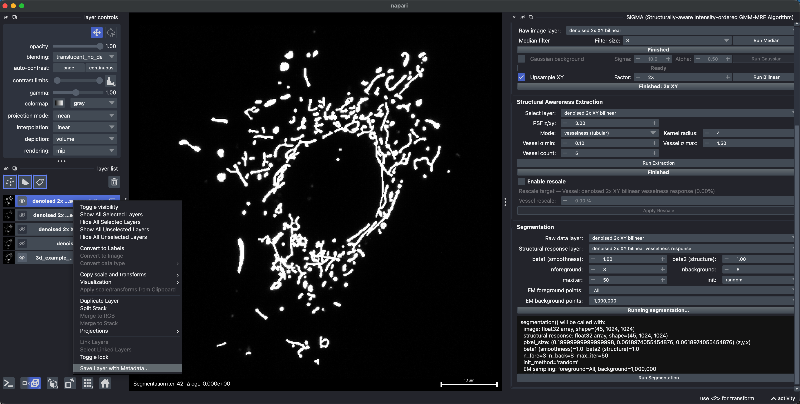

# Segmentation: 3D mitochondria

[All examples](../README.md#examples) · [Segmentation reference](./segmentation.md)

This example segments a 3D mitochondrial volume containing both punctate and tubular structures. The source stack contains 45 Z slices on a 512 x 512 XY grid, with a voxel size of approximately 0.20 x 0.123795 x 0.123795 um (Z, Y, X).

**Example data:** [`3d_example_Mitochondria.tif`](../example/3d/3d_example_Mitochondria.tif)

## 1. Load the mitochondrial volume

Load the 3D TIFF and confirm the Z, Y, and X dimensions and voxel sizes before processing.

## 2. Filter and upsample XY

Run the median filter with a filter size of 3. Select the resulting denoised layer, enable **Upsample XY**, set the factor to **2x**, and click **Run Bilinear**. This doubles the XY sampling grid from 512 x 512 to 1024 x 1024 while retaining all 45 Z slices. The XY pixel size becomes approximately 0.0618974 um; the Z spacing and physical field of view remain unchanged.

The finer grid represents narrow gaps between closely apposed mitochondria with more samples. This reduces the tendency of the pairwise MRF smoothness prior to bridge neighboring structures, helping them remain separate for subsequent object-based morphology analysis. Upsampling improves the computational representation of these gaps; it does not increase optical resolution.

## 3. Extract vesselness

Select the upsampled layer under **Structural Awareness Extraction** and use **vesselness** mode. Set `PSF z/xy = 3.00`, a kernel radius of 4, five scales, and a vessel sigma range of 0.10 to 1.50, then click **Run Extraction**. Leave **Enable rescale** unchecked for this example.

## 4. Run SIGMA

Use the upsampled intensity volume as **Raw data layer** and its vesselness result as **Structural response layer**. This example uses:

- `beta1 = 1.00` and `beta2 = 1.00`
- `nforeground = 3` and `nbackground = 8`
- `maxiter = 50` and `init = random`
- **EM foreground points:** `All`; **EM background points:** `1,000,000`

Click **Run Segmentation**. SIGMA combines intensity evidence, neighborhood coherence, and the vesselness response to produce a foreground mask in a new napari layer.

## 5. Save the result with metadata

After segmentation finishes, select the result in napari's **layer list**, right-click that layer, and choose **Save Layer with Metadata...**. Save as **TIFF (`.tif` or `.tiff`)** to retain source-derived metadata, including axes, physical pixel/voxel sizes, and units, together with the result.

The saved calibration follows the selected layer, including any changes in sampling from XY upsampling. Use TIFF rather than PNG or JPEG when physical-size metadata must be preserved.

