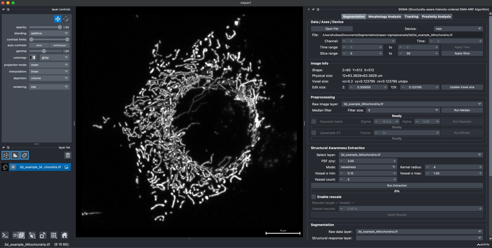
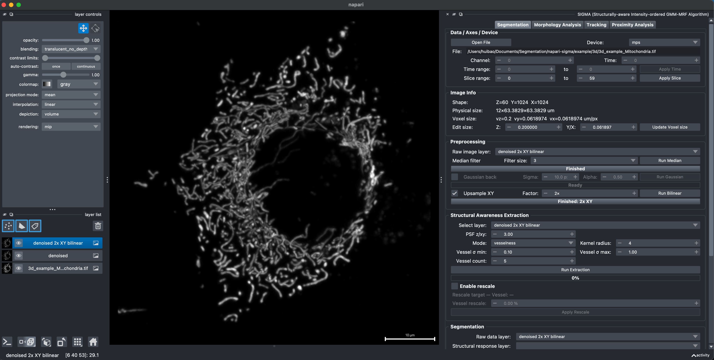
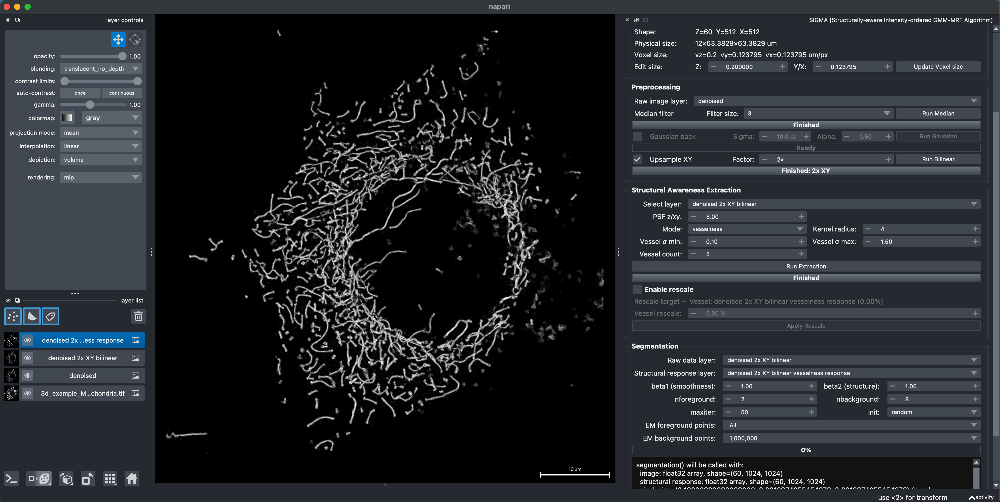
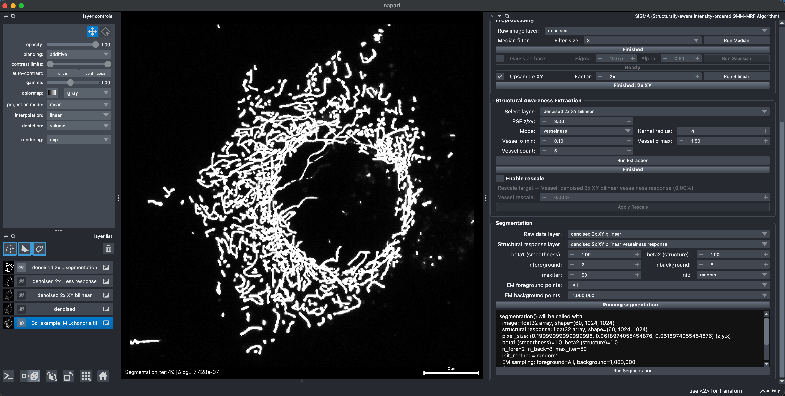
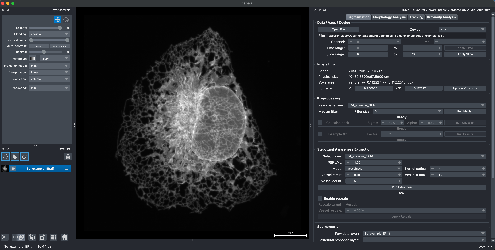
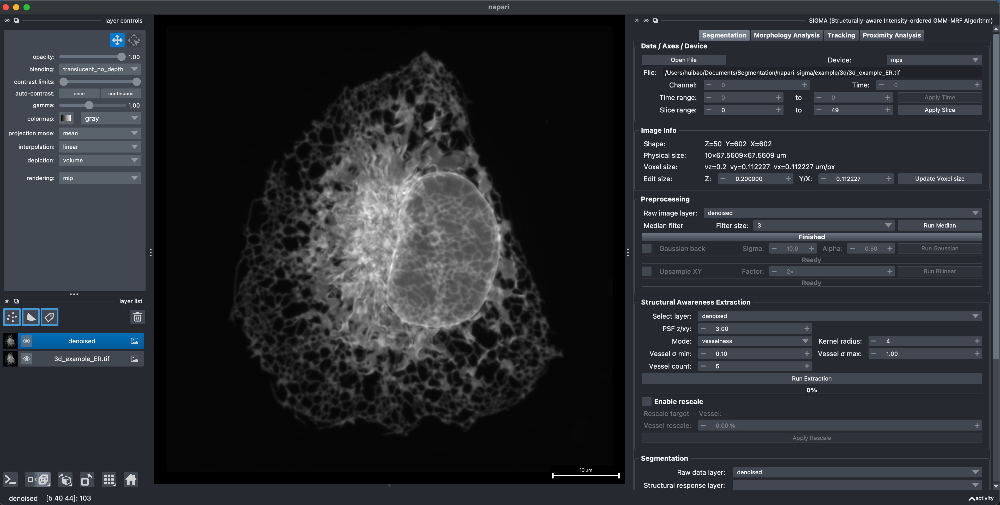
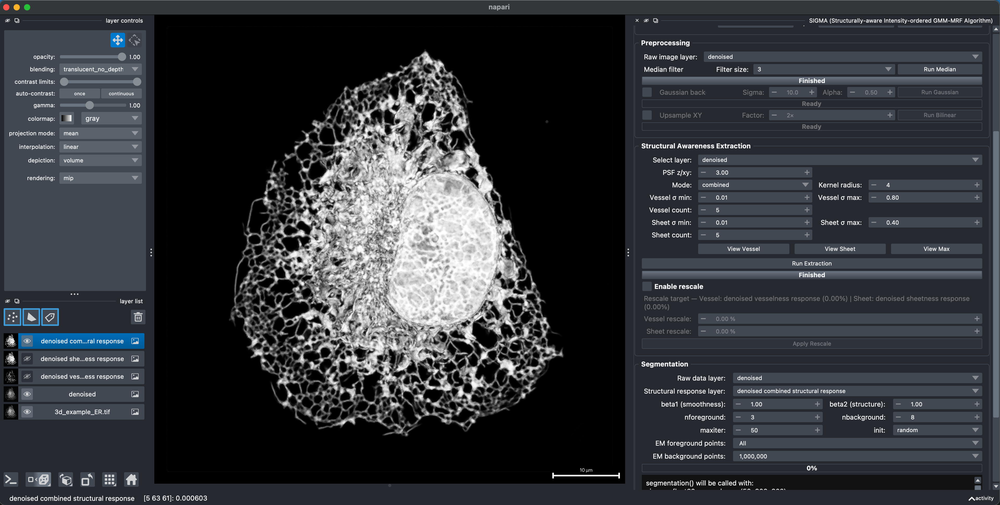
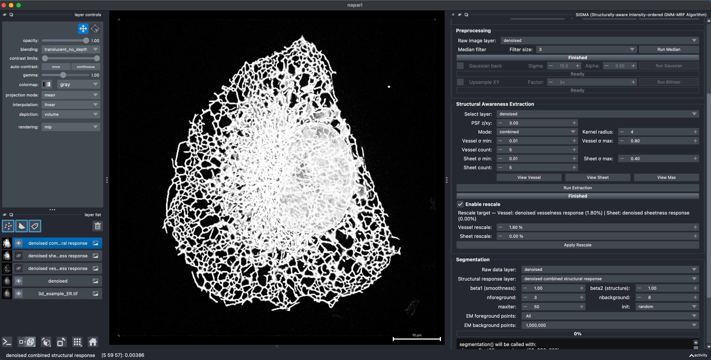
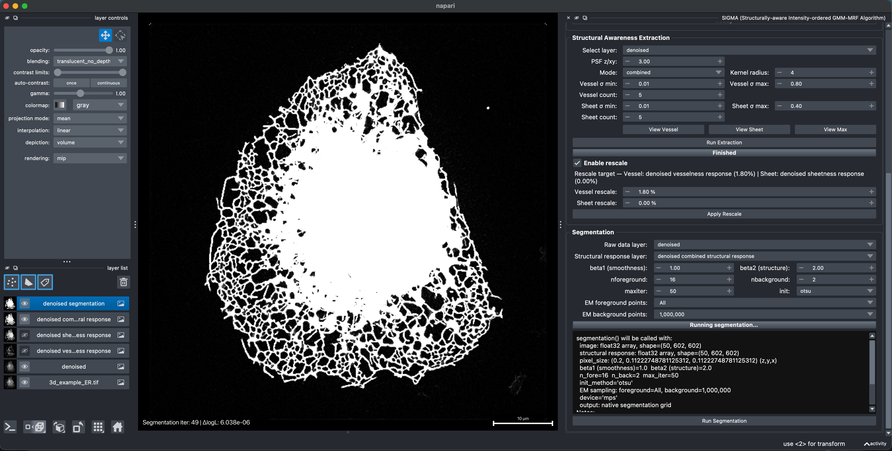
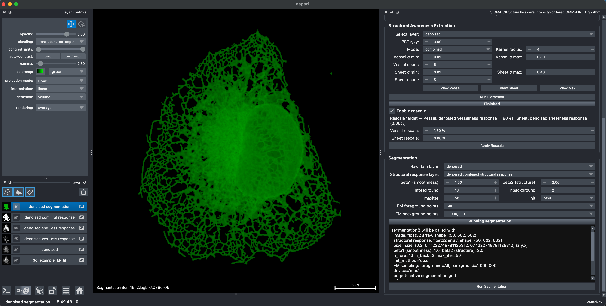

# Segmentation

The Segmentation tab implements SIGMA's annotation-free, image-adaptive segmentation workflow. SIGMA combines an image-specific Gaussian mixture model (GMM) with intensity-ordered class assignment and a Markov random field (MRF) prior guided by Hessian-derived local structural evidence. No annotated training masks are required. The interface organizes image setup, optional preprocessing, structural response extraction, and GMM-MRF inference across five sections.

## Recommended workflow

1. Open the image under **Data / Axes / Device**.
2. Confirm axes and physical size under **Image Info**.
3. Optionally preprocess the intensity layer under **Preprocessing**.
4. Run **Structural Awareness Extraction**.
5. Select the raw and structural-response layers under **Segmentation**.
6. Run SIGMA and inspect the inferred foreground mask in napari.

## 2D segmentation example

The following example shows the complete 2D workflow in chronological order.

**Example data:** [`2d_example_raw.tif`](../example/2d/2d_example_raw.tif)

### 1. Load the raw image

Drag the 2D image directly into napari, or click **Open File** and choose its file path. Confirm the pixel size, then select the raw layer as the input for preprocessing and structural awareness extraction.

### 2. Remove salt-and-pepper noise

Under **Preprocessing**, select the raw image and run the median filter to suppress isolated noise while retaining the narrow mitochondrial signal. This example uses a filter size of 3.

### 3. Enhance mitochondrial structures with vesselness

Under **Structural Awareness Extraction**, select the median-filtered layer and choose **vesselness** mode. The multiscale Hessian-derived vesselness response provides local evidence for tubular mitochondrial structures during segmentation. This example uses a kernel radius of 4, a sigma range of 0.10 to 1.00, and five scales.

### 4. Run SIGMA

Use the median-filtered intensity image as **Raw data layer** and the vesselness result as **Structural response layer**, then run SIGMA. The intensity-ordered GMM estimates foreground and background intensity states from this image, while the MRF combines neighborhood coherence with the vesselness evidence. The final binary foreground mask appears as a new napari layer.

## 3D mitochondrial segmentation example

This example segments a 3D mitochondrial volume containing many closely apposed tubular structures. The source stack contains 60 Z slices on a 512 x 512 XY grid.

**Example data:** [`3d_example_Mitochondria.tif`](../example/3d/3d_example_Mitochondria.tif)

### 1. Load the mitochondrial volume

Load the 3D TIFF and confirm the Z, Y, and X dimensions and voxel sizes before processing.

### 2. Filter and upsample XY

Run the median filter with a filter size of 3, then enable **Upsample XY**, set the factor to **2x**, and run bilinear upsampling. This doubles the XY sampling grid from 512 x 512 to 1024 x 1024.

The finer grid represents narrow gaps between closely apposed mitochondria with more samples. This reduces the tendency of the pairwise MRF smoothness prior to bridge neighboring structures, helping them remain separate for subsequent object-based morphology analysis. Upsampling improves the computational representation of these gaps; it does not increase optical resolution.

### 3. Extract vesselness

Select the upsampled layer under **Structural Awareness Extraction** and use **vesselness** mode. This example uses `PSF z/xy = 3.00`, a kernel radius of 4, five scales, and a vessel sigma range of 0.10 to 1.50.

### 4. Run SIGMA

Use the upsampled intensity volume as **Raw data layer** and its vesselness result as **Structural response layer**, then run SIGMA. The resulting foreground mask preserves more narrow separations between closely apposed mitochondria, providing cleaner individual objects for morphology analysis.

## 3D ER segmentation example

This example segments a 3D endoplasmic reticulum (ER) volume. The source stack contains 50 Z slices with a voxel size of approximately 0.20 x 0.112 x 0.112 um.

**Example data:** [`3d_example_ER.tif`](../example/3d/3d_example_ER.tif)

### 1. Load the ER volume

Drag the 3D TIFF into napari or select it with **Open File**. Confirm the Z, Y, and X dimensions and voxel sizes before processing.

### 2. Remove isolated noise

Under **Preprocessing**, run a median filter with a filter size of 3. The filtered volume is used as the intensity image for both structural awareness extraction and segmentation.

### 3. Extract a combined structural response

Under **Structural Awareness Extraction**, choose **combined** mode. This computes a tubular vesselness response and a plate-like sheetness response, then uses their voxelwise maximum so that ER tubules and sheets can both contribute local structural evidence. In this example, vessel sigma spans 0.01 to 0.80 and sheet sigma spans 0.01 to 0.40, with five scales for each response.

### 4. Strengthen the vesselness signal

Enable rescaling and apply a 1.80% rescale to the vesselness response while leaving sheetness unscaled. This increases the contribution of weak tubular ER signal before the combined structural response is passed to SIGMA.

### 5. Initialize foreground with Otsu

Select the median-filtered volume as **Raw data layer** and the rescaled combined result as **Structural response layer**. For this ER volume, use `beta1 = 1.00`, `beta2 = 2.00`, `nforeground = 16`, and `nbackground = 2`.

Set **init** to **otsu** so that strong intensity signal above the Otsu threshold seeds the initial foreground assignment. SIGMA then estimates the ordered foreground and background intensity mixtures and refines the labels using intensity likelihood, neighborhood coherence, and the structural response.

### 6. Adjust the projection for presentation

For a clearer view of the 3D mask, display the segmentation as a volume using **average** rendering and **mean** projection, with a lower gamma to reveal structures that occupy fewer Z slices. This changes only the napari presentation; it does not modify the segmentation data.

## Data / Axes / Device

- **Open File** loads the source image.
- **Device** selects CPU, CUDA, or MPS.
- **Channel** and **Time** choose the displayed channel or frame.
- **Time range** and **Slice range** restrict the data used by later processing.

## Image Info

Image Info reports the interpreted shape, physical extent, and pixel or voxel size. Use **Edit size** only when the source metadata is absent or incorrect. Physical size affects scale-aware structural extraction and morphology or proximity measurements.

## Preprocessing

Choose the source under **Raw image layer** before running a preprocessing step.

### Median filter

The median filter suppresses isolated noise while preserving sharp boundaries. Larger filter sizes are more aggressive and can remove narrow structures.

### Gaussian background

Gaussian background subtraction removes slowly varying background intensity.

- **Sigma** controls the background spatial scale.
- **Alpha** controls how strongly the estimated background is subtracted.

### Upsample XY

XY upsampling increases lateral sampling before structural extraction and segmentation. It can improve the representation of narrow gaps between closely apposed objects and thereby reduce MRF bridging, but it increases memory use and computation time. It does not increase the optical resolution of the source image.

When an upsampled layer is segmented, SIGMA returns the final mask to the original XY resolution while retaining separated labels where the original grid permits it.

## Structural Awareness Extraction

SIGMA derives local structural evidence from multiscale, scale-normalized Hessian responses. Select the input layer and choose a response mode:

- **vesselness** uses a Frangi-style response to emphasize tubular structures.
- **sheetness** emphasizes plate-like structures in 3D; in 2D it returns the tubular response.
- **combined** computes vesselness and sheetness and takes their voxelwise maximum.

Key settings:

- **PSF z/xy** is the axial-to-lateral point-spread-function ratio used to account for optical anisotropy in 3D derivative filtering.
- **Kernel radius** controls the spatial support of the derivative filters.
- **Sigma min/max** set the smallest and largest structural scales to evaluate.
- **Count** sets the number of scales between the selected limits.
- **Enable rescale** enables optional percentile rescaling after extraction.

Use **View Vessel**, **View Sheet**, or **View Max** to inspect available components. Rescaling is applied only after pressing **Apply Rescale**.

## GMM-MRF Segmentation

Select the intensity image under **Raw data layer** and its aligned extraction result under **Structural response layer**. SIGMA balances three terms during label inference: the image-specific GMM intensity likelihood, pairwise neighborhood coherence, and class-specific local structural support.

- **beta1 (smoothness)** weights pairwise spatial coherence between neighboring labels.
- **beta2 (structure)** weights structure-aware regularization from the selected response.
- **nforeground** sets the number of intensity-ordered foreground Gaussian components.
- **nbackground** sets the number of intensity-ordered background Gaussian components.
- **maxiter** sets the maximum number of GMM-MRF iterations.
- **init** selects random or Otsu-based initialization.
- **EM foreground points** sets the foreground sample budget; `All` uses every available point.
- **EM background points** sets the background sample budget; `All` uses every available point.

The preview displays the effective settings before execution. Progress is updated after each segmentation iteration.

## Output

Segmentation produces a binary foreground mask aligned with the source image. Use this layer directly in Morphology Analysis or Tracking, or pair it with an independently segmented fluorescence channel in Proximity Analysis. Save as TIFF when axes and physical scale need to remain embedded in the output file.
