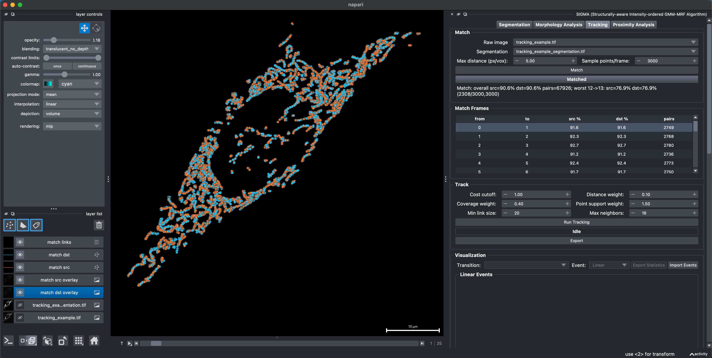
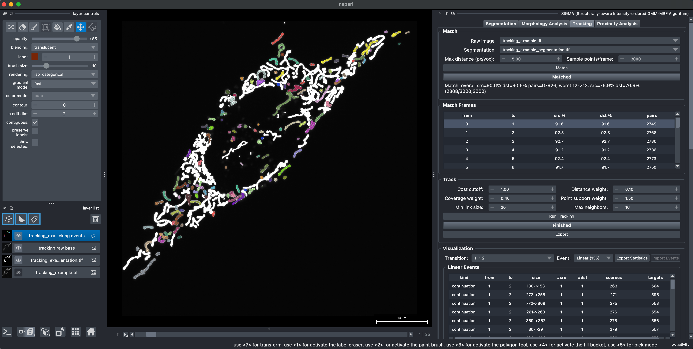
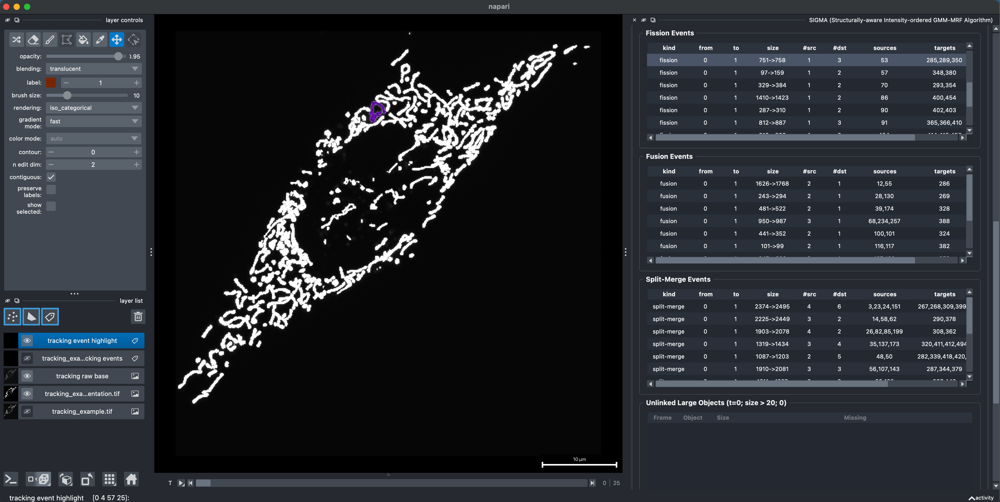
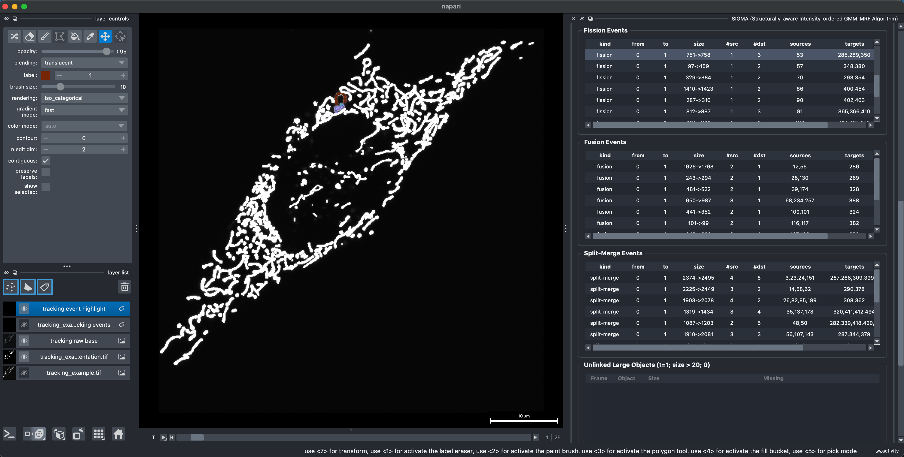
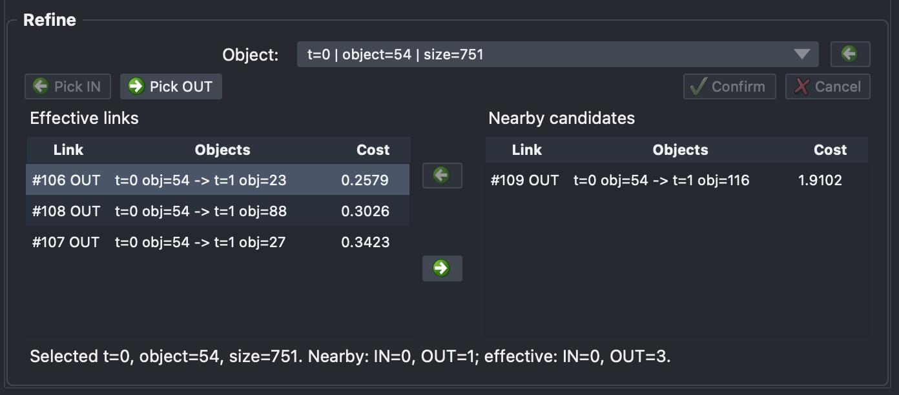

# Tracking Analysis: 3D time series

[All examples](../README.md#examples)

Tracking Analysis associates segmented objects between adjacent frames under a minimum-displacement assumption. It samples raw fluorescence within each object, matches those points across a frame pair, aggregates the correspondences into candidate object links, and classifies the retained link graph as linear, fission, fusion, or split-merge remodeling.

## Input requirements

- **Raw image** must contain the intensity time series.
- **Segmentation** must be spatially and temporally aligned with the raw image.
- Both inputs in this example use `TZYX` axes: time, Z, Y, and X.

The raw image is required because point allocation and sampling use fluorescence intensity rather than segmentation geometry alone.

## Example data

- **Raw image:** [`tracking_example.tif`](../example/Tracking/tracking_example.tif)
- **Segmentation:** [`tracking_example_segmentation.tif`](../example/Tracking/tracking_example_segmentation.tif)

Open both TIFF files, then select them under **Raw image** and **Segmentation**, respectively. They contain aligned 3D time series with **26 time points** and **39 Z slices per time point** (`TZYX`). Each frame is a 3D volume; tracking associates objects across adjacent time points, not between adjacent Z slices.

## 1. Match adjacent frames

Select the raw image and segmentation, then configure:

- **Max distance** sets the initial point-matching radius in the pixel or voxel units shown by the interface.
- **Sample points/frame** sets the total point budget for each frame; zero uses all available object points.

Object point budgets are distributed by integrated raw intensity. Points within each object are selected using intensity-weighted centroidal Voronoi sampling. SIGMA compensates for global frame translation, builds nearby source-target candidates, and solves a one-to-one linear assignment for the sampled points. Press **Match** before running tracking.

The result summary reports source coverage, target coverage, the number of matched point pairs, and the weakest adjacent-frame match. The **Match Frames** table provides the same information for every `from -> to` frame pair.

## 2. Inspect matches interactively

Click a row in **Match Frames** to inspect that adjacent-frame match in napari. SIGMA hides the raw and segmentation input layers, displays sampled source points in orange and target points in cyan, and draws the accepted point correspondences as links. The viewer moves to the target frame of the selected pair.

This preview is useful for checking whether **Max distance** and **Sample points/frame** provide adequate coverage before building object links.

## 3. Run tracking

Press **Run Tracking** after matching completes.

- **Cost cutoff** is the maximum cost accepted during the initial link selection.
- **Distance weight** controls the contribution of normalized object displacement to link cost.
- **Coverage weight** controls the contribution of bidirectional matched-object coverage.
- **Point support weight** controls the contribution of shared point support.
- **Min link size** allows objects at or below this size to be terminal birth or death observations.
- **Max neighbors** sets the maximum number of candidate links retained around an object.

Objects larger than **Min link size** are checked for missing incoming and outgoing links. Rescue links can be added when the initial candidate selection leaves a large object unlinked.

Event classification uses the connectivity of all effective links for a transition:

- **Linear**: one source and one target.
- **Fission**: one source contributes to multiple targets.
- **Fusion**: multiple sources contribute to one target.
- **Split-Merge**: a many-to-many connected event contains both splitting and merging structure.

After tracking finishes, SIGMA creates the tracking visualization layers and fills the event tables for each transition.

## 4. Inspect tracking interactively

Under **Visualization**, select a transition and event type. Clicking an event row highlights its source and target objects and moves through the participating adjacent frames. The tables separate linear, fission, fusion, and split-merge events so that each transition can be reviewed independently.

Double-click a tracked object in the viewer to select it. SIGMA synchronizes the corresponding event rows and the Refine object selection, then color-highlights the selected object together with its effective incoming sources and outgoing targets. Move between neighboring frames to inspect the predecessor and successor sides of the selected object's context.

The **Unlinked Large Objects** table lists objects above **Min link size** that still lack an incoming or outgoing link for the displayed frame.

## 5. Refine links

Select an object from the **Object** list, double-click it in the viewer, or click it in **Unlinked Large Objects**. Selecting an event row can also scope Refine to the links participating in that event.

For the selected object, **Effective links** contains the currently active incoming and outgoing links, while **Nearby candidates** contains available inactive links. Each row identifies the link as `IN` or `OUT`, shows the connected objects, and reports its cost. Clicking any row previews the corresponding source and target objects in the viewer.

To edit the effective links:

1. Select a row under **Nearby candidates** and click the left arrow to add that IN or OUT link.
2. Select a row under **Effective links** and click the right arrow to remove it.
3. Use **Pick IN** to move to the previous frame and double-click a source object, or use **Pick OUT** to move to the next frame and double-click a target object.
4. Click **Confirm** to add the viewer-selected link, or **Cancel** to leave the link set unchanged. A confirmed viewer selection can create a valid adjacent-frame link even when it was not produced by the original candidate search.
5. Use the back-arrow button, Command-Z on macOS, or Control-Z elsewhere to undo the latest refinement.

Only the affected adjacent-frame transition is reclassified after refinement, and its event tables and visualization are refreshed. This supports manual correction of ambiguous associations caused by rapid movement, dense organization, or complex remodeling without rerunning the complete tracking calculation.

## Import and export

The **Track > Export** dialog exports selected event types as GIF or MP4. Choose the overlay image and frame rate in the dialog.

**Export Statistics** writes selected event tables for a chosen frame range as CSV, TXT, or XLSX. **Import Events** restores effective links from a previously exported event table, allowing refinement to continue without rerunning the original tracking calculation.
